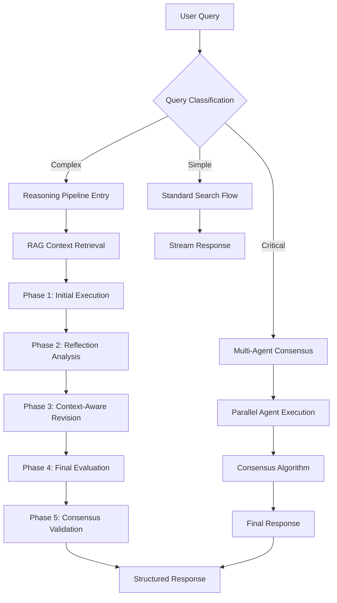

# Enhanced Data Journey - E.C.M Architecture

## 📂 Folder Structure

```text
.
├── .cursor
│   └── rules
│       ├── create-db-functions.mdc
│       ├── create-migration.mdc
│       ├── create-rls-policies.mdc
│       ├── postgres-sql-style-guide.mdc
│       └── writing-supabase-edge-functions.mdc
├── .env.local.example
├── .eslintrc.json
├── .github
│   └── ISSUE_TEMPLATE
│       ├── bug_report.yml
│       └── feature_request.yml
├── .gitignore
├── .vscode
│   └── settings.json
├── CODE_OF_CONDUCT.md
├── CONTRIBUTING.md
├── CREDITS.md
├── DATA_JOURNEY.md
├── Dockerfile
├── LICENSE
├── README.md
├── app
│   ├── api
│   │   ├── advanced-search
│   │   │   └── route.ts
│   │   ├── chat
│   │   │   ├── [id]
│   │   │   └── route.ts
│   │   ├── chat-history
│   │   │   └── route.ts
│   │   ├── chats
│   │   │   └── route.ts
│   │   ├── reasoning-pipeline
│   │   │   └── route.ts
│   │   └── upload
│   │       └── route.ts
│   ├── auth
│   │   ├── confirm
│   │   │   └── route.ts
│   │   ├── error
│   │   │   └── page.tsx
│   │   ├── forgot-password
│   │   │   └── page.tsx
│   │   ├── login
│   │   │   └── page.tsx
│   │   ├── oauth
│   │   │   └── route.ts
│   │   ├── sign-up
│   │   │   └── page.tsx
│   │   ├── sign-up-success
│   │   │   └── page.tsx
│   │   └── update-password
│   │       └── page.tsx
│   ├── favicon.ico
│   ├── globals.css
│   ├── layout.tsx
│   ├── opengraph-image.png
│   ├── page.tsx
│   ├── search
│   │   ├── [id]
│   │   │   └── page.tsx
│   │   ├── loading.tsx
│   │   └── page.tsx
│   └── share
│       ├── [id]
│       │   └── page.tsx
│       └── loading.tsx
├── bun.lock
├── components
│   ├── answer-section.tsx
│   ├── app-sidebar.tsx
│   ├── artifact
│   │   ├── artifact-content.tsx
│   │   ├── artifact-context.tsx
│   │   ├── artifact-root.tsx
│   │   ├── chat-artifact-container.tsx
│   │   ├── reasoning-content.tsx
│   │   ├── retrieve-artifact-content.tsx
│   │   ├── search-artifact-content.tsx
│   │   ├── tool-invocation-content.tsx
│   │   └── video-search-artifact-content.tsx
│   ├── chat-messages.tsx
│   ├── chat-panel.tsx
│   ├── chat-share.tsx
│   ├── chat.tsx
│   ├── clear-history.tsx
│   ├── collapsible-message.tsx
│   ├── current-user-avatar.tsx
│   ├── custom-link.tsx
│   ├── default-skeleton.tsx
│   ├── empty-screen.tsx
│   ├── external-link-items.tsx
│   ├── file-upload.tsx
│   ├── forgot-password-form.tsx
│   ├── guest-menu.tsx
│   ├── header.tsx
│   ├── inspector
│   │   ├── inspector-drawer.tsx
│   │   └── inspector-panel.tsx
│   ├── login-form.tsx
│   ├── message-actions.tsx
│   ├── message.tsx
│   ├── model-selector.tsx
│   ├── question-confirmation.tsx
│   ├── reasoning-section.tsx
│   ├── related-questions.tsx
│   ├── render-message.tsx
│   ├── retrieve-section.tsx
│   ├── retry-button.tsx
│   ├── search-mode-toggle.tsx
│   ├── search-results-image.tsx
│   ├── search-results.tsx
│   ├── search-section.tsx
│   ├── section.tsx
│   ├── sidebar
│   │   ├── chat-history-client.tsx
│   │   ├── chat-history-section.tsx
│   │   ├── chat-history-skeleton.tsx
│   │   ├── chat-menu-item.tsx
│   │   └── clear-history-action.tsx
│   ├── sign-up-form.tsx
│   ├── theme-menu-items.tsx
│   ├── theme-provider.tsx
│   ├── tool-badge.tsx
│   ├── tool-section.tsx
│   ├── ui
│   │   ├── alert-dialog.tsx
│   │   ├── avatar.tsx
│   │   ├── badge.tsx
│   │   ├── button.tsx
│   │   ├── card.tsx
│   │   ├── carousel.tsx
│   │   ├── checkbox.tsx
│   │   ├── codeblock.tsx
│   │   ├── collapsible.tsx
│   │   ├── command.tsx
│   │   ├── dialog.tsx
│   │   ├── drawer.tsx
│   │   ├── dropdown-menu.tsx
│   │   ├── icons.tsx
│   │   ├── index.ts
│   │   ├── input.tsx
│   │   ├── label.tsx
│   │   ├── markdown.tsx
│   │   ├── popover.tsx
│   │   ├── resizable.tsx
│   │   ├── select.tsx
│   │   ├── separator.tsx
│   │   ├── sheet.tsx
│   │   ├── sidebar.tsx
│   │   ├── skeleton.tsx
│   │   ├── slider.tsx
│   │   ├── sonner.tsx
│   │   ├── spinner.tsx
│   │   ├── status-indicator.tsx
│   │   ├── switch.tsx
│   │   ├── textarea.tsx
│   │   ├── toggle.tsx
│   │   ├── tooltip-button.tsx
│   │   └── tooltip.tsx
│   ├── update-password-form.tsx
│   ├── user-menu.tsx
│   ├── user-message.tsx
│   ├── video-carousel-dialog.tsx
│   ├── video-result-grid.tsx
│   ├── video-search-results.tsx
│   └── video-search-section.tsx
├── components.json
├── docker-compose.yaml
├── docs
│   ├── CONFIGURATION.md
│   └── ENVIRONMENT_REFERENCE.md
├── hooks
│   ├── use-current-user-image.ts
│   ├── use-current-user-name.ts
│   └── use-mobile.tsx
├── lib
│   ├── actions
│   │   ├── chat-history.ts
│   │   └── chat.ts
│   ├── agents
│   │   ├── generate-related-questions.ts
│   │   ├── manual-researcher.ts
│   │   └── researcher.ts
│   ├── auth
│   │   └── get-current-user.ts
│   ├── config
│   │   ├── default-models.json
│   │   └── models.ts
│   ├── constants
│   │   └── index.ts
│   ├── correctionHandler.ts
│   ├── hooks
│   │   ├── use-copy-to-clipboard.ts
│   │   └── use-media-query.ts
│   ├── redis
│   │   └── config.ts
│   ├── schema
│   │   ├── question.ts
│   │   ├── related.tsx
│   │   ├── retrieve.tsx
│   │   └── search.tsx
│   ├── streaming
│   │   ├── create-manual-tool-stream.ts
│   │   ├── create-tool-calling-stream.ts
│   │   ├── handle-stream-finish.ts
│   │   ├── parse-tool-call.ts
│   │   ├── tool-execution.ts
│   │   └── types.ts
│   ├── supabase
│   │   ├── client.ts
│   │   ├── middleware.ts
│   │   └── server.ts
│   ├── tools
│   │   ├── question.ts
│   │   ├── retrieve.ts
│   │   ├── search
│   │   │   └── providers
│   │   ├── search.ts
│   │   └── video-search.ts
│   ├── types
│   │   ├── index.ts
│   │   └── models.ts
│   └── utils
│       ├── context-window.ts
│       ├── cookies.ts
│       ├── index.ts
│       ├── registry.ts
│       └── url.ts
├── middleware.ts
├── next.config.mjs
├── package.json
├── postcss.config.mjs
├── prettier.config.js
├── public
│   ├── config
│   │   └── models.json
│   ├── icons
│   │   ├── icon-192.png
│   │   └── icon-512.png
│   ├── images
│   │   └── placeholder-image.png
│   ├── manifest.json
│   ├── offline.html
│   ├── providers
│   │   └── logos
│   │       ├── IMG_SEGMENT_20250512_230644.png
│   │       ├── anthropic.svg
│   │       ├── azure.svg
│   │       ├── deepinfra.svg
│   │       ├── deepseek.svg
│   │       ├── fireworks.svg
│   │       ├── google.svg
│   │       ├── groq.svg
│   │       ├── ollama.svg
│   │       ├── openai-compatible.svg
│   │       ├── openai.svg
│   │       └── xai.svg
│   ├── screenshot-2025-05-04.png
│   └── sw.js
├── searxng-limiter.toml
├── searxng-settings.yml
├── supabase
│   └── migrations
│       └── 20240625000000_create_chat_history.sql
├── tailwind.config.ts
└── tsconfig.json

58 directories, 211 files
```

---

## 🧠 Advanced Multi-Phase Reasoning Pipeline

### Enhanced Architecture Overview



## 🔄 Enhanced Data Flow Architecture

### 1. **Query Classification & Routing**

```typescript
// Enhanced query classification at entry point
async function classifyQuery(query: string): Promise<QueryClassification> {
  const classification = await runClassificationAssistant(query)
  return {
    complexity: 'simple' | 'complex' | 'critical',
    domain: string[],
    requiresRAG: boolean,
    requiresConsensus: boolean,
    confidenceThreshold: number
  }
}
```

**Data Flow:**
1. **Query Entry** → `app/api/chat/route.ts` atau `app/reasoning-pipeline/route.ts`
2. **Classification** → Determines routing strategy
3. **Context Preparation** → RAG retrieval if needed
4. **Pipeline Selection** → Standard/Enhanced/Multi-Agent

### 2. **RAG Integration Layer**

```typescript
// RAG context retrieval before each phase
async function retrieveRAGContext(query: string, phase: string): Promise<RAGContext> {
  const vectorStore = await getVectorStore() // Weaviate/Pinecone
  const relevantDocs = await vectorStore.similaritySearch(query, {
    k: 10,
    filter: { phase, relevance_threshold: 0.7 }
  })
  
  return {
    documents: relevantDocs,
    metadata: { phase, timestamp: new Date() },
    confidence: calculateConfidence(relevantDocs)
  }
}
```

**Enhanced Data Journey:**
```
User Query → Query Classification → RAG Retrieval → Phase Execution
     ↓
Context Database (Vector Store) → Relevant Documents → Injected into Prompts
```

### 3. **Multi-Agent Consensus Architecture**

```typescript
// Parallel execution with multiple agents
async function runMultiAgentConsensus(prompt: string): Promise<ConsensusResult> {
  const agents = [
    { id: 'logical', assistant: logicalReasoningAssistant },
    { id: 'creative', assistant: creativeThinkingAssistant },
    { id: 'critical', assistant: criticalAnalysisAssistant }
  ]
  
  // Parallel execution
  const results = await Promise.all(
    agents.map(agent => runExecutionAssistant(agent.assistant, prompt))
  )
  
  // Consensus algorithm
  const consensus = await runConsensusAssistant({
    responses: results,
    weights: { logical: 0.4, creative: 0.3, critical: 0.3 }
  })
  
  return consensus
}
```

### 4. **Enhanced Pipeline Phases**

#### **Phase 1: Context-Aware Initial Execution**
```
RAG Context + User Query → Execution Assistant → Contextual Response
```

**Data Path:**
- `retrieveRAGContext(query, 'initial')` → Context documents
- Context + Query → Enhanced prompt template
- Execution Assistant → Initial response with context

#### **Phase 2: Multi-Dimensional Reflection**
```
Initial Response → [Logic Checker, Bias Detector, Fact Verifier] → Comprehensive Analysis
```

**Data Path:**
- Initial response → Multiple reflection agents (parallel)
- Logic integrity check → Logical consistency score
- Bias detection → Bias assessment report
- Fact verification → Factual accuracy score

#### **Phase 3: RAG-Enhanced Revision**
```
Reflection Results + Additional Context → Execution Assistant → Improved Response
```

**Data Path:**
- Reflection feedback → Context retrieval for gaps
- Additional RAG context → Knowledge augmentation
- Revised prompt → Final execution assistant

#### **Phase 4: Comprehensive Evaluation**
```
Final Response → [Integrity Scorer, Quality Assessor, Confidence Estimator] → Multi-Metric Evaluation
```

#### **Phase 5: Consensus Validation (NEW)**
```
Final Response → Multiple Validator Agents → Consensus Score → Accept/Reject/Revise
```

### 5. **Dynamic Context Management**

```typescript
// Context state management across phases
class ContextManager {
  private phaseContext: Map<string, any> = new Map()
  private globalContext: RAGContext
  
  async updateContext(phase: string, data: any) {
    this.phaseContext.set(phase, {
      ...this.phaseContext.get(phase),
      ...data,
      timestamp: new Date()
    })
    
    // Update vector store with learned context
    await this.persistContext(phase, data)
  }
  
  getFullContext(): ComprehensiveContext {
    return {
      global: this.globalContext,
      phases: Object.fromEntries(this.phaseContext),
      metadata: this.generateMetadata()
    }
  }
}
```

### 6. **Enhanced Response Structure**

```typescript
interface EnhancedPipelineResponse {
  success: boolean
  query_classification: QueryClassification
  rag_context: RAGContext
  
  // Multi-phase results
  phases: {
    initial_execution: PhaseResult
    multi_reflection: MultiReflectionResult
    rag_revision: PhaseResult
    comprehensive_evaluation: EvaluationResult
    consensus_validation: ConsensusResult
  }
  
  // Final outputs
  final_response: string
  confidence_metrics: {
    overall_confidence: number
    integrity_score: number
    consensus_score: number
    rag_relevance: number
  }
  
  // Learning data
  correction_feedback?: CorrectionData
  improvement_suggestions: string[]
  
  // Metadata
  metadata: {
    requestId: string
    timestamp: string
    execution_time: number
    phases_completed: number
    agents_used: string[]
    context_sources: string[]
  }
}
```

### 7. **Continuous Learning Loop**

```typescript
// Enhanced correction handler with learning
async function handleEnhancedCorrection(
  query: string,
  response: string,
  userCorrection: string,
  pipeline_metadata: any
) {
  // Store correction in vector database
  await vectorStore.addDocuments([{
    content: `Query: ${query}\nResponse: ${response}\nCorrection: ${userCorrection}`,
    metadata: {
      type: 'correction',
      confidence_score: pipeline_metadata.confidence_metrics.overall_confidence,
      timestamp: new Date()
    }
  }])
  
  // Update model weights based on correction
  await updateAgentWeights(pipeline_metadata.agents_used, userCorrection)
  
  // Generate improvement suggestions
  const improvements = await generateImprovementSuggestions(
    query, response, userCorrection
  )
  
  return improvements
}
```

## 🔍 Decision Tree Enhancement

```
User Query
    ├── Complexity Analysis
    │   ├── Simple (< 0.3) → Standard Search Flow
    │   ├── Complex (0.3-0.7) → Enhanced Pipeline (5 phases)
    │   └── Critical (> 0.7) → Multi-Agent Consensus + Pipeline
    │
    ├── Domain Analysis
    │   ├── Technical → Specialist agent pool
    │   ├── Creative → Creative reasoning agents
    │   └── Analytical → Logic-focused agents
    │
    ├── Context Requirements
    │   ├── Requires RAG → Vector store retrieval
    │   ├── Real-time data → Web search integration
    │   └── Historical → Archive retrieval
    │
    └── Quality Requirements
        ├── High stakes → Multi-agent consensus
        ├── Standard → Single agent pipeline
        └── Exploratory → Creative agent emphasis
```

## 🗄️ Enhanced Data Persistence

### **Vector Store Schema (Weaviate/Pinecone)**
```json
{
  "class": "ReasoningContext",
  "properties": {
    "content": "text",
    "query_type": "string",
    "phase": "string",
    "confidence_score": "number",
    "agent_id": "string",
    "correction_applied": "boolean",
    "improvement_score": "number",
    "timestamp": "date"
  }
}
```

### **PostgreSQL Schema Enhancement**
```sql
-- Enhanced chat history with pipeline metadata
ALTER TABLE chat_history ADD COLUMN pipeline_metadata JSONB;
ALTER TABLE chat_history ADD COLUMN confidence_scores JSONB;
ALTER TABLE chat_history ADD COLUMN rag_context JSONB;

-- Correction tracking
CREATE TABLE correction_feedback (
  id SERIAL PRIMARY KEY,
  chat_id UUID REFERENCES chat_history(id),
  original_response TEXT,
  user_correction TEXT,
  improvement_score FLOAT,
  applied_at TIMESTAMP DEFAULT NOW()
);
```

## 📊 Monitoring & Observability

### **Enhanced Logging Structure**
```typescript
// Comprehensive logging per phase
const logger = {
  phase: (phase: string, data: any) => {
    console.log(`[PHASE-${phase}] ${JSON.stringify({
      timestamp: new Date().toISOString(),
      phase,
      data,
      memory_usage: process.memoryUsage(),
      execution_time: performance.now()
    })}`)
  },
  
  consensus: (agents: string[], results: any[]) => {
    console.log(`[CONSENSUS] ${JSON.stringify({
      agents,
      results_summary: results.map(r => r.confidence),
      consensus_reached: results.every(r => r.confidence > 0.7)
    })}`)
  }
}
```

Arsitektur enhanced ini memberikan:
- **Intelligent routing** berdasarkan query complexity
- **Context-aware reasoning** dengan RAG integration
- **Multi-agent consensus** untuk critical decisions
- **Continuous learning** dari user corrections
- **Comprehensive evaluation** dengan multiple metrics
- **Scalable architecture** untuk production deployment
